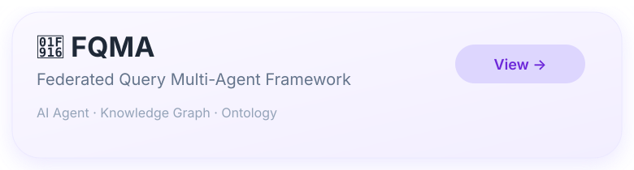
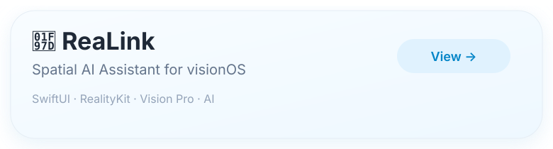
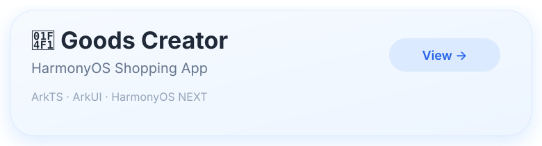
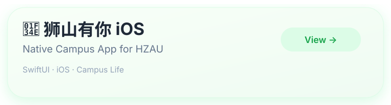

<table>
<tr>

<td width="75%" align="center">

  

  

</td>

<td width="38%" align="center">

</td>

</tr>
</table>

## 关于我 | About me | 自己紹介

<b>🇨🇳 中文</b>

- 🎓 华中农业大学信息学院计算机科学与技术专业本科生
- 📱 热爱移动 App 开发，专注于 iOS、HarmonyOS 与全栈应用开发
- 🔬 科研方向包括 AI Agent、知识图谱、人机交互（HCI）与空间计算
- 🎨 喜欢简约、美观、自然的 UI / UX 设计，希望技术与设计相辅相成
- 🚀 致力于打造智能、易用、令人愉悦的软件产品
- 🌸 喜欢二次元、J-POP，也乐于将灵感融入产品设计

<b>🇺🇸 English</b>

- 🎓 Computer Science Undergraduate at Huazhong Agricultural University
- 📱 Passionate about mobile app development, with a focus on iOS, HarmonyOS and full-stack applications
- 🔬 Research interests include AI Agents, Knowledge Graphs, Human–Computer Interaction (HCI) and Spatial Computing
- 🎨 I enjoy crafting clean, intuitive and delightful UI/UX experiences where technology and design complement each other
- 🚀 Building intelligent software that feels natural and useful, where AI enhances the experience instead of becoming the center of attention
- 🌸 Anime enthusiast and J-POP lover

<b>🇯🇵 日本語</b>

- 🎓 華中農業大学 コンピュータサイエンス専攻 学部生
- 🍎 Appleプラットフォーム、SwiftUI、visionOS、空間コンピューティングを中心にアプリを開発しています
- 🤖 AIエージェント、ナレッジグラフ、ヒューマン・コンピュータ・インタラクション（HCI）に興味があります
- 📜 JLPT N2 合格
- 🎵 J-POPが好きです
- 🚀 AIを前面に押し出すのではなく、自然で心地よいユーザー体験を実現するソフトウェアを目指しています

## 🚀 Featured Projects

